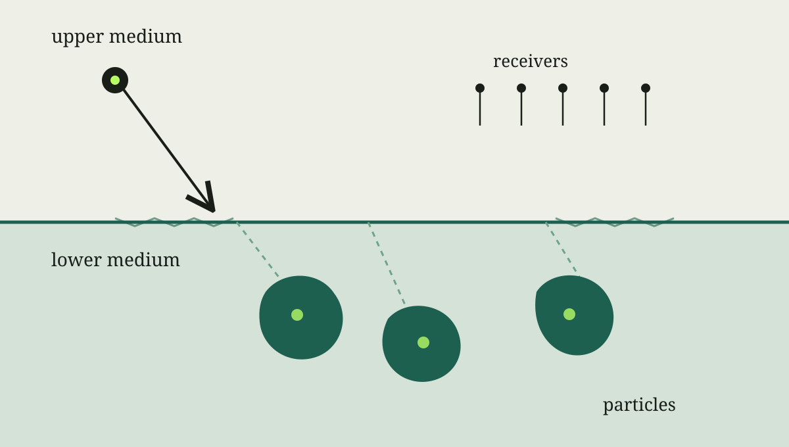

> **写作示范**：这篇文章演示如何介绍研究背景并链接论文。下方公式是概念性的边界积分表示，不替代论文中的具体推导。

均匀介质里的波传播已经可以产生复杂的多次散射。若再加入材料界面，每个散射体受到的波既包含外部入射波，也包含其他粒子的响应和界面反射。下面的示意图把这些要素放在同一个场景中。

*图 1 · 两层介质中的多粒子散射示意。实际几何和边界条件请以论文为准。*

## 为什么需要快速算法

从边界积分的角度看，一个概念性的散射场表示可以写为

$$
\mathbf{u}^{\mathrm{sc}}(\mathbf{x})
= \sum_{j=1}^{M}
  \int_{\partial D_j}
  \mathbf{G}_{\mathrm{layer}}(\mathbf{x},\mathbf{y})
  \boldsymbol{\varphi}_j(\mathbf{y})\,\mathrm{d}s_{\mathbf{y}}.
$$

这里的 $D_j$ 是第 $j$ 个散射体，$\mathbf{G}_{\mathrm{layer}}$ 表示考虑背景分层后的格林张量，$\boldsymbol{\varphi}_j$ 是待求的边界密度。粒子数 $M$ 增长后，粒子之间的耦合计算会成为重要成本。

## 近期工作

我与 Yixiao He、Jun Lai 合作的预印本 [*A fast solver for many-particle elastic scattering in layered media*](https://arxiv.org/abs/2608.26875) 研究层状介质中多粒子时谐弹性散射的快速求解。论文将层状介质的贡献表示为 Sommerfeld 积分，并结合边界积分、散射矩阵、多次散射理论与快速多极方法。

与 Jun Lai 合作的另一篇预印本讨论三维声散射中多极展开方法的[谱收敛性](https://arxiv.org/abs/2608.26884)。正式写研究介绍时，可以在这里增加实验图、算法流程图以及你想强调的具体贡献。
