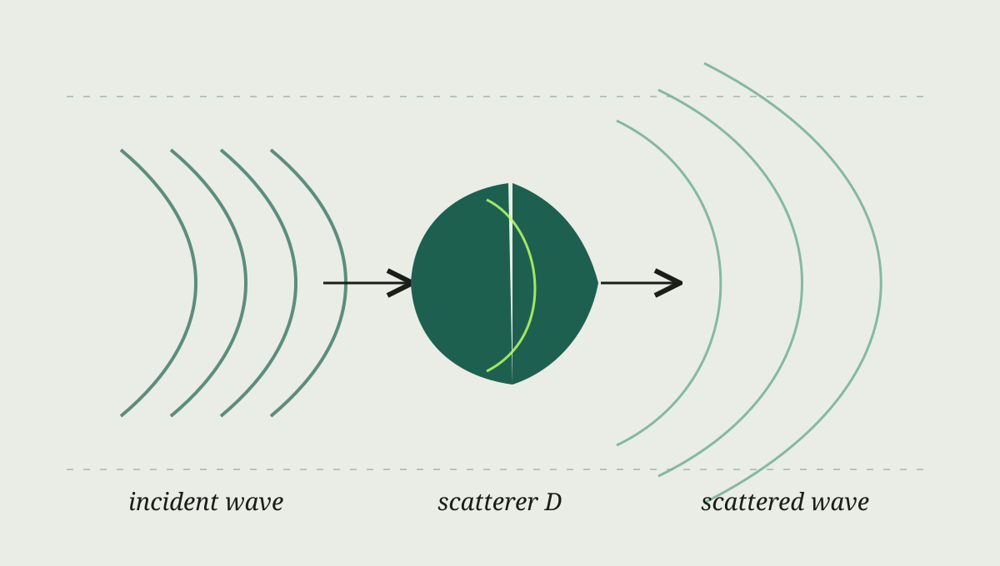

> **写作示范**：这篇文章是排版样例，并非我的新研究结果。你可以复制此文件，用 Markdown 写自己的博客。

波散射问题可以从一个直观场景开始：已知的入射波照向物体，物体改变波的传播方向，我们在远处或边界上记录响应。数学模型会随声波、电磁波或弹性波而变化。这里先用标量声波模型演示公式排版。

*图 1 · 二维散射的示意图。*

## 最简化的方程

若 $D$ 表示散射体，$k$ 表示波数，那么在散射体外部，场 $u$ 满足 Helmholtz 方程：

$$
\Delta u + k^2u = 0
\qquad \text{in } \mathbb{R}^2 \setminus \overline{D}.
$$

总场可以写成入射场和散射场之和，即 $u=u^{\mathrm{inc}}+u^{\mathrm{sc}}$。完整问题还需要边界条件和远场辐射条件；不同的物理模型会给出不同的条件。

## 正问题与反问题

正问题从物体的形状和介质参数出发，计算观测到的波。反问题的方向相反：从观测数据推断物体的位置、形状或材料性质。实际研究中，多粒子相互作用和复杂背景介质会显著增加计算难度。

我与合作者关于三维多粒子弹性散射快速求解的早期工作可见 [arXiv:2204.03302](https://arxiv.org/abs/2204.03302)。这里的标量模型只是教学示意，具体论文使用的是弹性波模型。
